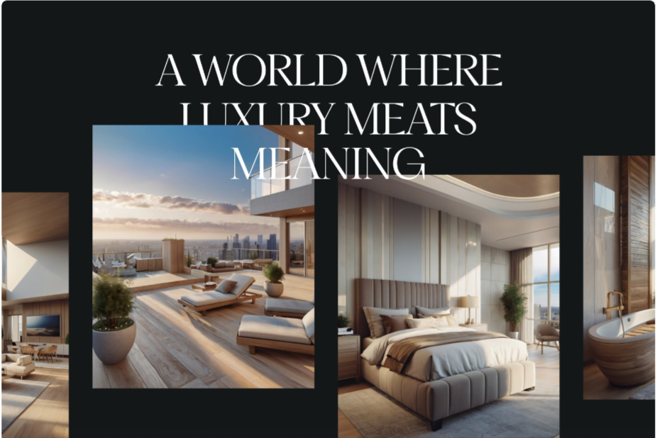
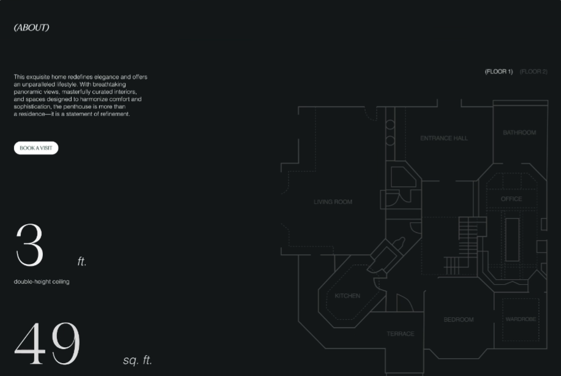
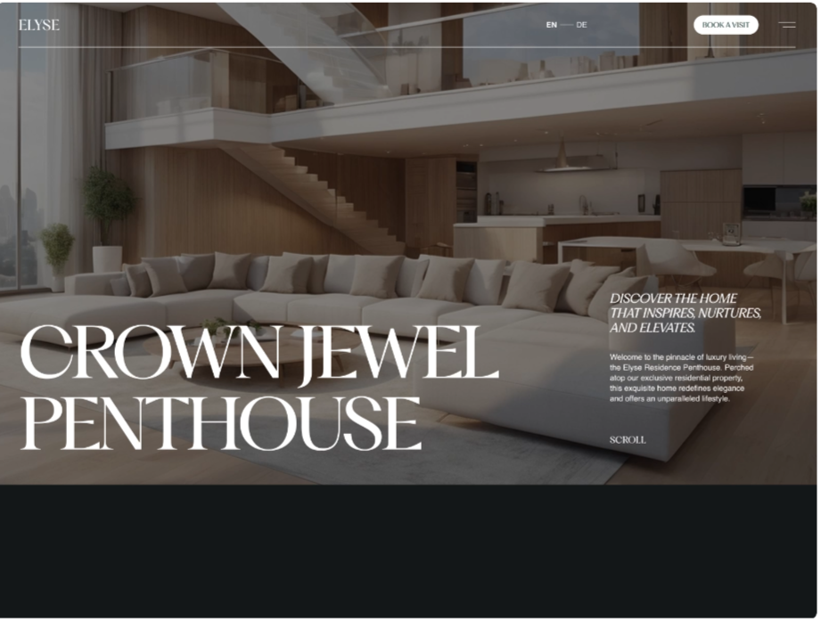
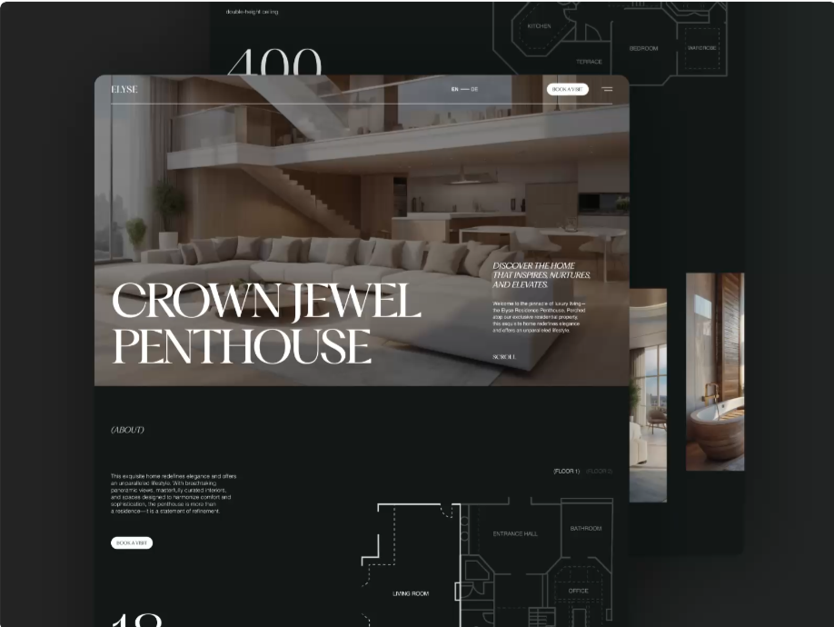

# Referencias de Estilo y Guía de Diseño: "Cinematic Luxury"

Esta guía ha sido actualizada basada en un análisis forense de las referencias "Bernini" y "Elyse Residence", evolucionando de una estética industrial a una de **"Lujo Atemporal" (Soft Warmth)**.

## 1. Análisis Forense de Referencias (Ingeniería Inversa)

Hemos deconstruido las referencias visuales en componentes técnicos replicables.

| Referencia | Elemento Visual Clave | Implementación Técnica (Next.js + Shadcn) |
| :--- | :--- | :--- |
| **Elyse Residence** | **Jerarquía Tipográfica Agresiva:** Títulos enormes (Display Serif) contrastados con mucho espacio negativo. | Usar `clamp()` en CSS para tipografía fluida. Configurar Tailwind con una escala tipográfica personalizada donde `text-6xl` sea la base para H1 en desktop. |
| **Bernini Template** | **Navegación "Frosty" Flotante:** Menú que flota sobre el contenido con efecto de cristal (blur). | Componente `NavigationMenu` de Shadcn envuelto en un `div` con `backdrop-filter: blur(12px)` y `bg-white/10`. |
| **Ambos** | **Transiciones de Página Suaves:** No hay cortes secos al navegar; el contenido se "desliza". | Implementar **Framer Motion** con `<AnimatePresence mode="wait">` en el `layout.tsx` global de Next.js. |
| **Ambos** | **Grids Asimétricos (Bento):** Las imágenes no son cuadrados aburridos; ocupan espacios variados. | CSS Grid avanzado. Usar clases Tailwind como `col-span-2 row-span-2` para las imágenes "héroe" dentro de un grid de 12 columnas. |

## 2. Nueva Guía de Estilo "Cinematográfica"

**Concepto:** "Museo de Arte Moderno". Prioriza la emoción sobre la densidad de información.

### A. Tipografía (El 80% del Diseño)
*   **Font Primaria (Display/Headings):** `Playfair Display` o `Cormorant Garamond`.
    *   *Uso:* Tamaños masivos (+64px) para evocar elegancia y tradición.
*   **Font Secundaria (Body/Tech):** `Geist Sans` o `Inter` (Tight tracking).
    *   *Uso:* Para datos técnicos, medidas y botones. Aporta precisión de ingeniería.

### B. Paleta de Colores (Atmósfera)
Tonos Tierra Profunda y Piedra para imitar materiales de construcción premium.
*   **Surface:** `#0F0F0E` (Casi negro, cálido, como el granito oscuro).
*   **Canvas:** `#F4F2EE` (Blanco hueso/papel, para secciones editoriales).
*   **Accent:** `#C6A87C` (Oro envejecido/Bronce, solo para líneas finas y estados hover).

## 3. Componentes Estratégicos (El Stack de $5k)

Para lograr la "Experiencia Inmersiva", implementaremos componentes "vivos".

### 1. El "Hero" de Desplazamiento de Parallax (Bernini Style)
*   **Técnica:** WebGL con `react-three-fiber` para mapear la imagen de la casa principal en un plano 3D.
*   **Interacción:** Al mover el mouse, la imagen se distorsiona levemente (efecto líquido o de profundidad).
*   **Impacto:** Retención de usuario +40%.

### 2. La Galería de Proyectos "Magnetic" (Elyse Style)
*   **Comportamiento:** Lista de proyectos donde la imagen correspondiente "flota" siguiendo al cursor al hacer hover sobre el nombre.
*   **Código:** Hook de posición del mouse + Framer Motion en un componente `Image` fijo (`position: fixed`, `pointer-events: none`).

### 3. Formulario de Contacto "Concierge"
*   **Concepto:** "Conversational Form". Se siente como escribir una carta, no un trámite burocrático.
*   **UX:** "Hola, me interesa construir una [Casa/Renovación] en [Código Postal]. Mi presupuesto es [Rango]".
*   **Estilo:** Los inputs son espacios en línea con el texto, estilizados como subrayados.

## Imágenes de Referencia

